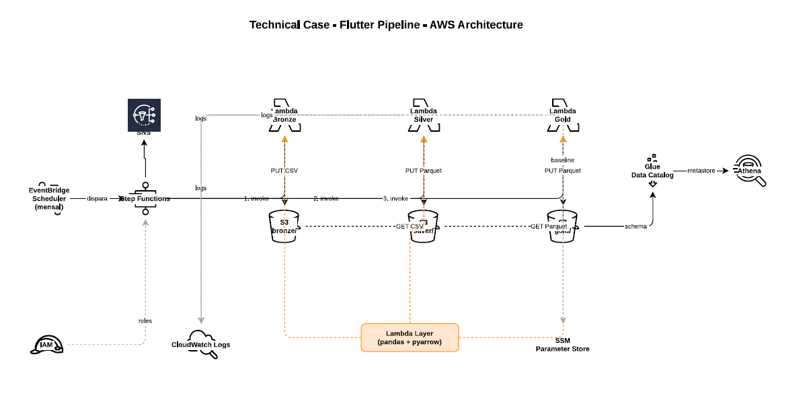
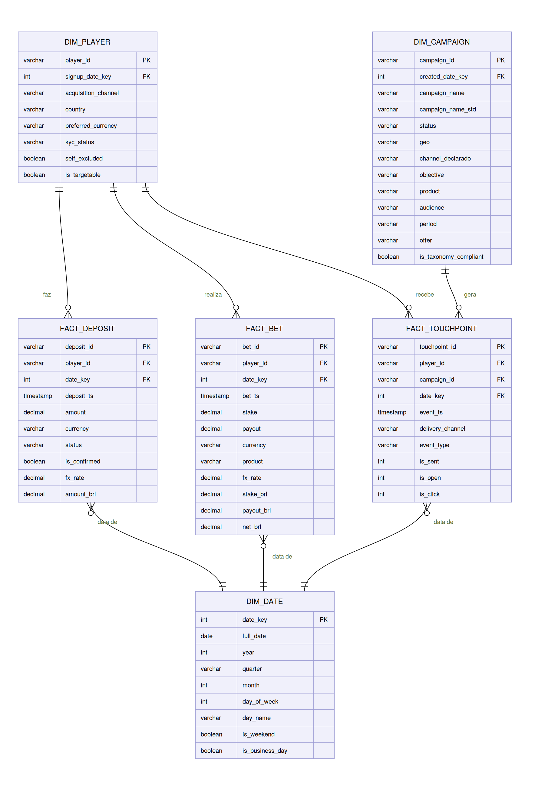

# Case Técnico: Martech Specialist | Flutter Brazil

Pipeline que responde: **quais jogadores dormentes vale a pena reativar, com qual oferta, e quanto eles valem.**

## Definições adotadas

| Conceito | Definição | Por quê |
|---|---|---|
| **Atividade** | depósito confirmado **ou** aposta | Jogador segue engajado |
| **Dormente** | > 30 dias sem atividade | Taxa de retorno cai abaixo de 50% |
| **Nunca ativou** | sem depósito e sem aposta | Problema de onboarding |

## A resposta

Dos 250 jogadores, **119 são alvos dormentes acionáveis**: dormentes, com valor, liberados pelo compliance.

**Dentre os 119, mire os 30 jogadores das faixas Q4 e Q3 parados entre 31 e 84 dias, com `bonus50`**, a oferta de maior LTV médio e maior alcance. 

Três achados que mudaram a leitura:

- **O canal `unknown` é o mais valioso**: R$ 6.991 de LTV médio, 51% acima do segundo.
- **Produto não segmenta**: 206 dos 213 apostadores jogam nos dois.
- **Acima de 84 dias** nenhum jogador da base jamais voltou: ali é reaquisição, não reativação.
  
## Como rodar

```bash
./build_lambdas.sh                               # empacota src/ em lambda/

cd infra/terraform
cp terraform.tfvars.example terraform.tfvars     # confira o pandas_layer_arn da região
terraform init && terraform apply

aws s3 cp ../../data/raw/ s3://flutter-martech-lakehouse/bronze/ --recursive --include "*.csv"
terraform output -raw comando_disparar_pipeline | bash

cd ../.. && python infra/sql/run_athena.py infra/sql/athena_gold.sql infra/sql/athena_silver.sql
```

Layout esperado em bronze: `bronze/{entidade}/ingest_date=YYYY-MM-DD/{entidade}.csv`.

## Arquitetura



| Lambda | Lê → escreve | Faz |
|---|---|---|
| `flutter-fx` | Frankfurter → `reference/` | ingere cotações do BCE, materializa tabela diária densa |
| `flutter-silver` | `bronze/` → `silver/` | valida, deduplica, quarentena, tipa, converte para BRL, parseia taxonomia |
| `flutter-gold` | `silver/` → `gold/` | monta o star schema |

**O câmbio é uma Lambda separada** porque API é problema de ingestão, não de transformação.

### Infraestrutura

Tudo provisionado por Terraform (`infra/terraform/`). Serverless por escolha: o volume não justifica cluster, e Lambda + Athena custam zero parado.

| Recurso | Configuração |
|---|---|
| **S3** | bucket único, versionado, SSE-S3, acesso público bloqueado. Lifecycle expira `athena-results/` em 7 dias e versões antigas em 30 |
| **Lambda** × 3 | Python 3.13, layer `AWSSDKPandas`, 512 MB (fx) / 1 GB (silver, gold), timeout 300 s |
| **IAM** | uma role por Lambda, cada uma com `Deny` explícito de `PutObject` em `bronze/*` |
| **Step Functions** | Standard, sequencial, `Retry` com backoff exponencial só em erro transitório |
| **EventBridge Scheduler** | `cron(0 3 1 * ? *)` — mensal, dia 1 às 03:00 UTC |
| **Glue Data Catalog** | database `flutter_martech`, alimentado por DDL explícito (sem crawler) |
| **Athena** | workgroup dedicado, output location fixo, teto de 1 GB de scan por query |
| **CloudWatch** | log groups com 30 dias de retenção, 3 alarmes, 1 dashboard |

## Modelo de dados



Star schema Kimball: `dim_date`, `dim_player`, `dim_campaign` + `fact_deposit`, `fact_bet`, `fact_touchpoint`. Três fatos porque são três processos com grãos diferentes.

| Tabela | Tipo | Grão | Medidas |
|---|---|---|---|
| `dim_date` | dimensão | um dia corrido | — |
| `dim_player` | dimensão | um jogador | — |
| `dim_campaign` | dimensão | uma campanha | — |
| `fact_deposit` | transacional | uma tentativa de depósito | `amount`, `amount_brl` |
| `fact_bet` | transacional | uma aposta | `stake_brl`, `payout_brl`, `net_brl` |
| `fact_touchpoint` | sem medida (*factless*) | um evento de contato | contagem: `is_sent`, `is_open`, `is_click` |

Views para BI:

| View | Responde |
|---|---|
| `vw_player_360` | um jogador por linha: LTV, dormência, faixa de valor |
| `vw_segmentos_valor` | quantos jogadores e quanto valor em cada faixa |
| `vw_ltv_canal_oferta_produto` | LTV por canal × oferta × produto |
| `vw_conformidade_taxonomia` | aderência dos nomes ao padrão |
| `vw_dormencia_gaps` · `vw_dormencia_retorno` | evidência do limiar de 30 dias |

## Imperfeições tratadas

| Onde | O quê | Tratamento |
|---|---|---|
| `deposits` | 25 linhas byte-idênticas | quarentena, mantém a primeira |
| `players` | 22 sem `acquisition_channel` (8,8%) | vira `unknown` — descartar tiraria 1/10 do LTV por canal |
| `campaigns` | `C007` sem nome, `C008` fora do padrão | 0/7 segmentos, marcadas não-conformes |
| `campaigns` | `C002`, `C012` com separador ou ordem trocada | recuperados: o parser casa por vocabulário, não por posição |
| `campaigns` | `C005` com erro de grafia | recuperado por fuzzy match; empate vira `unknown`, nunca palpite |
| `campaigns` | `C004` sem `product` e `audience` | 5/7 segmentos |
| `touchpoints` | 2 eventos posteriores à data de referência | quarentena — usar toque futuro é vazamento temporal |
| `bets` | 2.080 linhas com `payout = 0` | mantidas: aposta perdida, não dado faltante |

Nada sai em silêncio: toda linha removida vai para `quarantine/` com o motivo, e um check garante `linhas_bronze == silver + quarentena`.

## Estrutura

```
README.md                 entregável principal
build_lambdas.sh          empacota src/ nos zips de lambda/
src/
  shared/                 motor de DQ, câmbio, taxonomia, I/O e logging
  fx/ silver/ gold/       um handler por camada
lambda/                   os zips prontos para deploy
data/raw/                 os 5 CSVs de origem
infra/
  terraform/              infraestrutura como código
  sql/                    DDL, views e o runner do Athena
  aws/                    state machine e políticas IAM de referência
docs/                     apresentação, dicionário de dados, diagramas
```
